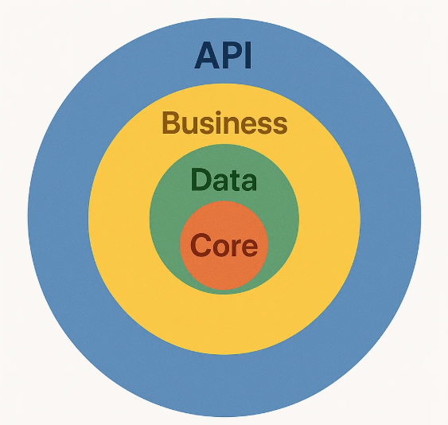

# FieldExpenseTracker

**FieldExpenseTracker**, saha çalışanlarının yaptığı harcamaların takibini kolaylaştırmak için geliştirilmiş bir gider yönetim sistemidir. Bu sistem, harcama taleplerinin oluşturulması, onay süreçlerinin yönetilmesi ve detaylı raporlamalar gibi temel ihtiyaçları karşılamak üzere geliştirilmiştir.

## API Dökümantasyonu
https://documenter.getpostman.com/view/26371085/2sB2j7d9MH 

## 🔧 Kullanılan Teknolojiler

| Katman | Teknoloji |
|--------|-----------|
| Backend | ASP.NET Core 8.0 Web API |
| ORM | Entity Framework Core 9 + Dapper |
| Veritabanı | Microsoft SQL Server |
| Caching | Redis |
| Queue | RabbitMQ |
| Kimlik Doğrulama | JWT (JSON Web Token) |
| İşlem Yönetimi | Unit of Work Pattern |
| Dependency Injection | Built-in DI container |
| Diğer | Serilog, AutoMapper, FluentValidation, MediatR |

---

## 📂 Proje Yapısı
FieldExpenseTracker
│

├── FieldExpenseTracker.API → API Katmanı (Başlangıç Projesi)

├── FieldExpenseTracker.Business → İş kuralları (Servisler, DTO'lar)

├── FieldExpenseTracker.Core → Entity'ler, Interface'ler, Ortak Yapılar

├── FieldExpenseTracker.Data → EF DbContext, Repository, Configs, Seeds




---

## 🚀 Başlangıç

### 1. Gerekli Bağımlılıklar

- .NET 8 SDK
- SQL Server
- Redis
- RabbitMQ

---

### 2. Veritabanı Ayarları

`appsettings.json` içinde aşağıdaki bağlantı dizesini kendi ortamınıza göre güncelleyin:

```json
"ConnectionStrings": {
  "SqlServer": "your-sql-connection-string"
}
"JwtConfig": {
    "Secret": "your-secret-key",
    "Issuer": "FieldExpenseTracker",
    "Audience": "FieldExpenseTracker",
    "AccessTokenExpiration": 55
}
  "Email": {
    "From": "your-source-gmail",
    "Password": "your-google-app-password",
    "SmtpHost": "smtp.gmail.com",
    "SmtpPort": "587"
   }

```

### 3.🛠️ Migration Oluşturma ve Uygulama

```bash
cd FieldExpenseTracker.Data
dotnet ef migrations add initialMigration  --output-dir .\Migrations --startup-project ..\FieldExpenseTracker.API
dotnet ef database update
```
## Çalıştırma

```bash
cd FieldExpenseTracker.API
dotnet run

```

### 4. 📌 Temel Özellikler


✅ Kullanıcı Giriş ve JWT ile Kimlik Doğrulama

✅ Harcamaların Oluşturulması ve Onaylanması

✅ Çalışan Bilgilerinin Yönetimi

✅ Redis ile Performanslı Cache Mekanizması

✅ RabbitMQ ile Asenkron Bildirim/Mesaj Gönderimi

✅ Dapper ile Optimize Raporlama Sorguları

✅ Unit of Work ile Transactional Veri Erişimi

✅ EF Fluent API + Seed Data ile Sağlam DB Tasarımı


### 5. 📬 RabbitMQ Kullanımı

RabbitMQ, harcama onayları gibi işlemlerde bildirim/event yönetimi için kullanılmaktadır. Publisher/Consumer yapısı aşağıdaki gibi çalışır:

Publisher: Yeni bir harcama eklendiğinde mesaj gönderir.

Consumer: Bu mesajı dinleyerek e-posta bildirimi veya başka bir işlemi tetikler.

---

### 6. 💾 Redis Kullanımı

Redis, sık kullanılan verilerin (kategoriler, kullanıcı bilgileri vb.) cache’lenmesi için kullanılmıştır.

Varsayılan ayarlar localhost:6379 şeklindedir.

---

### 7. 🔐 JWT Authentication

Kullanıcı girişinden sonra access token üretilir ve bu token ile API erişimi sağlanır. Authorization işlemleri middleware ile kontrol edilir.

---

### 8. Stored Procedure'ler

Rapor servisinin doğru çıktı verebilmesi için Stored procedure oluşturma komutlarını StoredProcedures.txt dosyasından alıp sql'de çalıştırmanız gerekmektedir.


